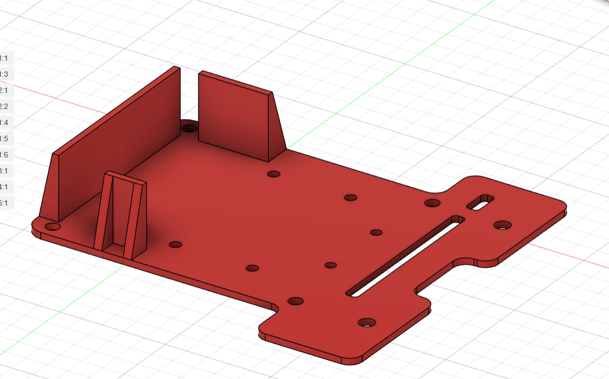
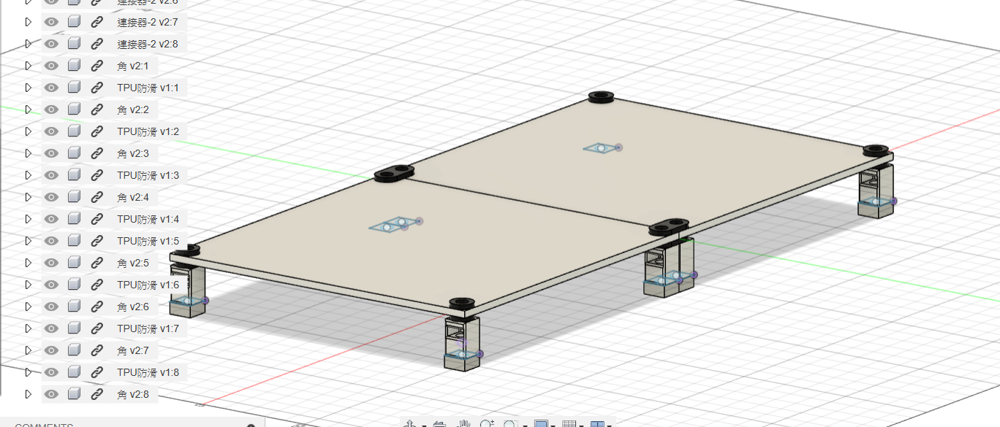

# TIRC接力循跡巡跡車

### 使用STM32F103C8T6作為主要處理器,結合紅外感測器模組,做成的一台巡線車,目前巡機車的狀態只有單環巡線控制,所以遇到異物無法保持扭力及速度

## 開發環境:
### - MDK-ARM
### - keil
### - ch340晶片

### 車體重新設計,進行配重計長度精算

## 軌道設計,為比賽軌道大小145mm X 145mm 25mm高度 , 高度為模擬高度,比賽高度為60mm

### 對於輕量化設計以及可組裝性上我有進行設計,軌道可以任意組裝,為了保證對接平整性我有使用雙卡扣加上螺絲螺母的設計,在每個一角都使用TPU列印保證韌性及防滑性,在移動軌道時不會輕易滑動,軌道的主體是使用PLA列印,白線的部分是用噴漆

### 照片區

